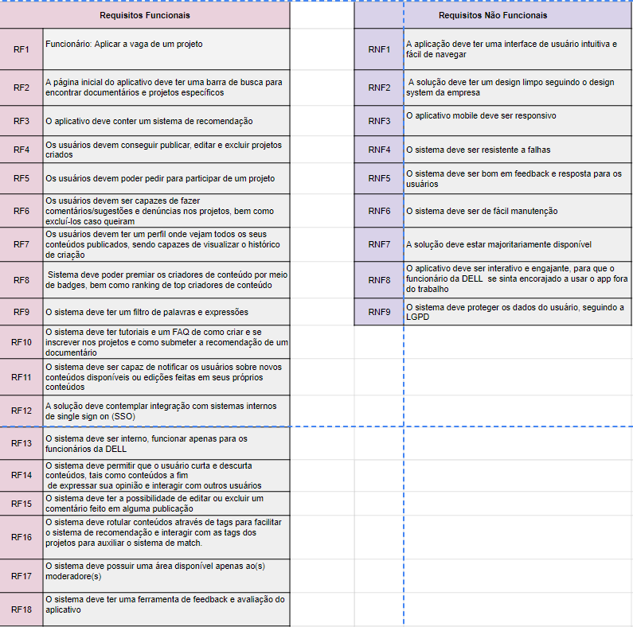
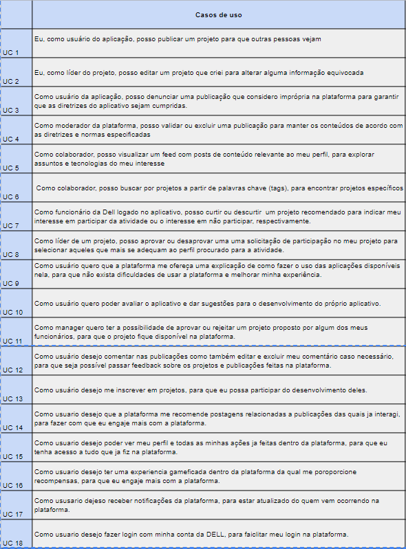
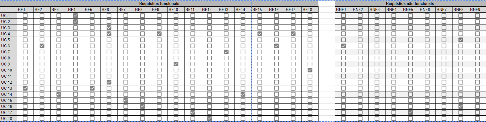

[template-documento1](../img/template-documento1.jpg)

<table>
<tr>
<table>
<tr>
<td>

</td>
<td>
</td>
</tr>
</table>

<h2> Nome do Projeto: App Dispositivo Móvel</h2>
<tr>
	<h2>Nome do Parceiro: DELL</h2>
<tr>
	<h2> Nome do Grupo: xxxx </h2>
<tr>
	<h2> Integrantes do grupo:</h2>
<tr>
<ul>
	<li>Ana Clara Loureiro Muller Zaidan</li>
	<li>Daniel Cunha</li>
  	<li>Jordan Andrade</li>
  	<li>Luísa Leite</li>
  	<li>Pedro Gattai</li>
 	<li> Wagner Estevam</li>
</ul>

**Conteúdo**

- [Visão Geral do Projeto](#visão-geral-do-projeto)
  - [Parceiro de Negócios](#parceiro-de-negócios)
  - [Problema](#problema)
    - [Análise do Problema](#análise-do-problema)
    - [Matriz de avaliação de valor Oceano Azul](#matriz-de-avaliação-de-valor-oceano-azul)
    - [Proposta de Valor e Value Proposition Canvas](#proposta-de-valor-e-value-proposition-canvas)
    - [Matriz de Risco](#matriz-de-risco)
    - [Análise financeira do projeto](#análise-financeira-do-projeto)
    - [Mapeamento do processo](#mapeamento-do-processo)
  - [Descritivo da Solução](#descritivo-da-solução)
    - [Objetivos](#objetivos)
      - [Objetivos gerais](#objetivos-gerais)
      - [Objetivos específicos](#objetivos-específicos)
    - [Justificativa](#justificativa)
  - [Partes Interessadas](#partes-interessadas)
- [Requisitos](#requisitos)
  - [Requisitos Funcionais](#requisitos-funcionais)
  - [Requisitos não Funcionais](#requisitos-não-funcionais)
  - [Perfis de Usuários](#perfis-de-usuários)
  - [Casos de Uso](#casos-de-uso)
- [Arquitetura do Sistema](#arquitetura-do-sistema)
- [UX e UI Design](#ux-e-ui-design)
  - [Wireframes](#wireframes)
  - [Design de Interface - Guia de Estilos](#design-de-interface---guia-de-estilos)
- [Projeto de Banco de Dados](#projeto-de-banco-de-dados)
  - [Modelo Conceitual](#modelo-conceitual)
  - [Modelo Lógico](#modelo-conceitual)
- [Testes de Software](#testes-de-software)
  - [Teste Unitário](#teste-unitário)
  - [Teste de Integração](#teste-de-integração)
  - [Teste de Regressão](#teste-de-regressão)
  - [Teste de Usabilidade](#teste-de-usabilidade)
  - [Teste de Funcionalidade](#teste-de-funcionalidade)
  - [Teste de API](#teste-de-api)
- [Documentação da API](#documentação-da-api)
- [Manual do Usuário](#Manual-do-usuário)
- [Referências](#referências)
- [Apêndice](#apêndice)

# Visão Geral do Projeto
	

## Parceiro de Negócios

A Dell é uma empresa que foi criada em 1984 com o objetivo de oferecer acesso fácil à melhor tecnologia em todos os lugares do planeta. Estão entre as maiores empresas de tecnologia do mundo, sendo líder no mercado de computadores pessoais, servidores, dispositivos de armazenamento, soluções de segurança e soluções de rede, atuando com diversos recursos extraordinários . As aplicações da Dell vão desde soluções de nuvem híbrida e computação de alto desempenho até iniciativas de impacto social e sustentabilidade.

## Problema

O problema identificado no projeto é a retenção de talentos dentro da Dell. Na empresa, alguns profissionais estão saindo da empresa por não estarem se sentindo desafiados, não estarem tendo oportunidades de ganhar novos conhecimentos e não se sentirem engajados e motivados.

### Análise do Problema

Como o problema está centrado na falta de engajamento e motivação dos funcionários em relação à Dell, urge que uma solução seja construída com base nesse óbice. Dessa forma, foi pensado como paliação um sistema que oferecesse e entregasse conteúdos que fizessem com que os funcionários pegassem o celular fora do horário de trabalho, fazendo com que eles queiram participar de projetos da empresa e que queiram aprender novos assuntos. Um dos benefícios esperados é a otimização do processo de seleção de tópicos interessantes por meio do sistema de recomendação. Outro benefício esperado é o aumento da transparência e comunicação entre os colaboradores, permitindo troca de feedbacks e críticas construtivas. 

### Matriz de avaliação de valor Oceano Azul

Definir 8 atributos que são importantes para os clientes e diferenciá-los da concorrência por meio das ações de Reduzir, Eliminar, Aumentar e Criar.

### Proposta de Valor e Value Proposition Canvas

Apresenta o Canvas de Proposta de Valor com relação à solução.

### Matriz de Risco

Apresenta a matriz de risco com relação ao projeto.
"

### Análise financeira do projeto

Informar o quanto o parceiro tem projetado para investir no projeto e quais são as projeções de custos e de receitas, relacionadas ao projeto (para o período de um ano), que o parceiro projeta ter.

## Mapeamento do processo

Apresentar a modelagem do processo "to be", representando em alto nível o fluxo de trabalho a ser realizado dentro da solução.

## Descritivo da Solução

A solução envolve a construção de um sistema de recomendação a partir de bases rotuladas de projetos e documentários fornecidos pelos colaboradores. Os usuários poderão criar e também interagir com conteúdos criados por outras pessoas, podendo fazer comentários, curtir, descurtir, dar match com as postagens e pedir para participar deles. Ademais, existirá a possibilidade de denunciar conteúdos que infrinjam as diretrizes da empresa e de visualizar uma FAQ(Frequently Asked Questions). Soma-se, ainda, o fato de poderem ver sua posição no ranking da empresa de acordo com seu engajamento no sistema.

### Objetivos

	
#### Objetivos gerais

O objetivo desta iniciativa é fomentar a retenção de talentos dentro da empresa Dell por meio do incentivo e aprendizagem de forma diferenciada.

#### Objetivos específicos

Como objetivos específicos, espera-se que a solução aumente o engajamento dos funcionários e faça com que eles se sintam motivados a pegarem o celular fora do horário de trabalho, fazendo com que eles se sintam cada vez como parte da empresa.

### Justificativa

A plataforma será desenvolvida na arquitetura de nuvem chamada IaaS (Insfrastructure as a Service), pois ela elimina a necessidade de investimento, monitoramento e manutenção em servidores locais. Dentre os diversos benefícios de se utilizar o IaaS, pode-se citar a eliminação de uma grande quantia de custos de capitais, a redução de custos contínuos, o aprimoramento da continuidade dos negócios, o aprimoramento da recuperação de desastres, a possibilidade de respostas mais rápidas às condições de negócios em mudança, o fornecimento de novos aplicativos para usuários com mais rapidez e a diminuição das chances de indisponibilidade.
Dessa forma, foi definido que a parte de front-end (client) da aplicação, ou seja, aquela que o usuário tem contato direto, será armazenada na Amazon S3, uma vez que essa hospeda sites estáticos, idealmente para aqueles que possuem script apenas na parte do cliente (AMAZON, 2023). Outrossim, usaremos o serviço Amazon CloudFront, que acelera a distribuição do conteúdo estático e dinâmico da web. Além disso, tanto para o back-end, quanto para o banco de dados, será usado para armazená-los a Amazon EC2, uma vez que essa aceita o dinamismo que essas áreas da aplicação exigem.

## Partes Interessadas 

Descrever os principais stakeholders envolvidos no projeto e seus papéis.

# Requisitos

Esta seção é importante porque permite que os desenvolvedores entendam claramente o que é esperado do software e quais serão as restrições e desafios enfrentados durante o desenvolvimento. Além disso, permite que os usuários finais saibam se o software atende às suas expectativas e se está adequado ao seu ambiente de trabalho.

A seção de requisitos do sistema é atualizada constantemente durante o ciclo de desenvolvimento do software, garantindo que todas as necessidades e especificações estejam sempre atualizadas.

## Requisitos Funcionais
Esta seção da documentação do software fornece uma descrição detalhada dos requisitos do sistema. Ela inclui informações sobre as funcionalidades esperadas do software, as restrições e limitações do sistema e outras especificações relevantes.

## Requisitos não Funcionais

Descreve os recursos necessários para sua execução, os requisitos de segurança e privacidade.
	
## Relação do 12-Factor App e Requisitos

	

## Perfis de Usuários 

A seção de perfil de usuário da documentação de software é responsável por descrever instruções detalhadas sobre o uso de cada opção e recursos relacionados ao perfil do usuário, garantindo uma experiência fácil e intuitiva para o usuário final.

## Casos de Uso

Neste projeto, para aprendermos mais sobre o fluxo do usuário, aplicamos as técnicas de User Stories e Casos de uso. Os dois têm como principal objetivo resumir os detalhes do usuário no sistema e suas interações com ele.

As User Stories seguem um modelo base, contendo os seguintes elementos:

PERFIL: perfil do usuário que realizará a ação

DEVO/POSSO: obrigatoriedade da ação

AÇÃO: o que será realizado

OBJETIVO: qual a finalidade da ação.

Formando a frase: Como PERFIL, DEVO/POSSO AÇÃO para OBJETIVO

Para o diagrama dos casos de uso, criamos três atores: um administrador, um moderador e um funcionário Dell, que seria o usuário principal. Depois, inserimos as ações e intenções de cada um no sistema.
	

	

	

	
01 - Como usuário da aplicação, posso publicar um projeto para que outras pessoas vejam
	
02 - Como líder do projeto, posso editar um projeto que criei para alterar alguma informação equivocada

		

## Matriz de Rastreabilidade
### Requisitos Funcionais e Não Funcionais

	
### Casos de Uso
	

	
### Matriz de Rastreabilidade
	

Segue o link do sheets para análise detalhada da matriz de rastreabilidade: https://docs.google.com/spreadsheets/d/1h7dybGE_3WqlJQOYH61XaNoXmFmM-0_dJddb_wh2OYs/edit?usp=sharing
		

# Arquitetura do Sistema

Atualizar a cada revisão/atualização da arquitetura, mantendo todas as 3 versões no documento..

[template-documento4](../img/template-documento4.jpg)

Exemplo de Diagrama de Arquitetura

# UX e UI Design

Aborda o design e a funcionalidade da aplicação ou sistema em questão. Ela fornece informações sobre como o software é projetado para ser fácil de usar e intuitivo para os usuários. Nesta seção, deve ser possível encontrar descrições detalhadas sobre as principais características e recursos da interface do usuário, como botões, menus, ícones e outros elementos que são utilizados para facilitar a interação do usuário com o software. Além disso, são fornecidos exemplos de como as funcionalidades do software são acessadas e usadas pelos usuários, incluindo informações sobre os passos necessários para realizar tarefas específicas. Esta seção também aborda as principais preocupações de UX, como acessibilidade, usabilidade, consistência e simplicidade. São apresentados exemplos de como o software é projetado para atender às necessidades dos usuários com diferentes tipos de habilidades e recursos.

## Wireframes

Telas de baixa fidelidade das áreas do usuário, conectados, demonstrando a diagramação e o fluxo de navegação.

Exemplos: tela da home, tela de login, etc. Em cada tela colocar: cabeçalho, rodapé, barra lateral, área de conteúdo.

Aqui você deve colocar o link para o wireframe ou colocar as imagens geradas na sequência correta do fluxo de navegação.

## Design de Interface - Guia de Estilos
Refere-se ao design visual, cores, tipografia, imagens, logotipos, ou seja, os elementos visuais que compõem o produto.
Aqui você deve colocar o link para seu documento de guia de estilos.

# Projeto de Banco de Dados

Documento contendo diagrama de entidades e relacionamentos do banco de dados

## Modelo Conceitual

O modelo conceitual deve garantir uma conexão com a realidade. Os 4 tipos de conexões com a realidade são:
conceitos
atributos
identificações
associações
O Modelo Entidade-Relacionamento - MER
entidades e tipos de entidades
atributos e tipos de atributos
relacionamentos e tipos de relacionamentos

## Modelo Lógico 

O modelo lógico de banco de dados é uma representação abstrata e simplificada dos dados armazenados no sistema. É utilizado para entender como os dados são relacionados e para garantir a integridade e consistência dos dados armazenados. Incluir  uma descrição detalhada das tabelas, campos e relações presentes no modelo lógico de banco de dados. Também serão apresentadas as regras de negócio e as restrições aplicadas aos dados para garantir a integridade e a consistência dos dados armazenados.

# Testes de Software

## Teste Unitário

Link ou imagem da tabela com dados organizados dos testes realizados.

## Teste de Integração

Link ou imagem da tabela com dados organizados dos testes realizados.

## Teste de Regressão

Link ou imagem da tabela com dados organizados dos testes realizados.

## Teste de Usabilidade 

Link ou imagem da tabela com dados organizados dos testes realizados.

## Teste de Funcionalidade 

Link ou imagem da tabela com dados organizados dos testes realizados.

## Teste de API 

Link ou imagem da tabela com dados organizados dos testes realizados.

# Documentação da API

Apresentar a documentação no formato Swagger ou aplicação equivalente com todas as requisições dos endpoints desenvolvidos e funcionando.

# Manual do Usuário

Fornecer instruções detalhadas sobre como usar o software corretamente. É uma ferramenta valiosa para ajudar os usuários a compreender as funções do software, instalar o software, configurar as preferências do usuário, entre outras tarefas. O manual do usuário geralmente inclui screenshots, animações e outros recursos visuais para tornar a experiência do usuário mais clara e intuitiva. Além disso, ele também pode incluir informações sobre solução de problemas, dicas e truques, bem como informações de contato para suporte técnico. É importante que a seção de manual do usuário seja atualizada frequentemente para garantir que os usuários tenham acesso à informação mais recente e precisa sobre o software.

# Referências

Toda referência citada no texto deverá constar nessa seção, utilizando o padrão de normalização da ABNT - ABNT NBR 10520). As citações devem ser confiáveis e relevantes para o trabalho. São imprescindíveis as citações dos sites de download das ferramentas utilizadas, bem como a citação de algum objeto, música, textura ou outros que não tenham sido produzidos pelo grupo, mas utilizados (mesmo no caso de licenças gratuitas, royalty free ou similares).
Sugerimos o uso do sistema autor-data para citações.

# Apêndice 

Os apêndices representam informações adicionais que não caberiam no documento exposto acima, mas que são importantes por alguma razão específica do projeto. 
