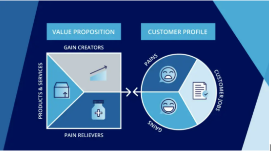
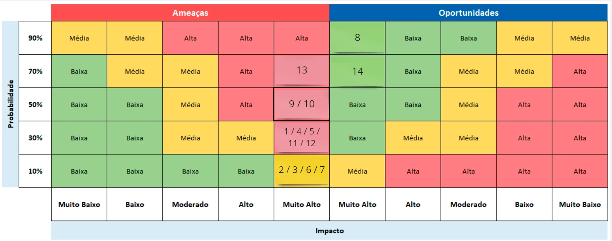
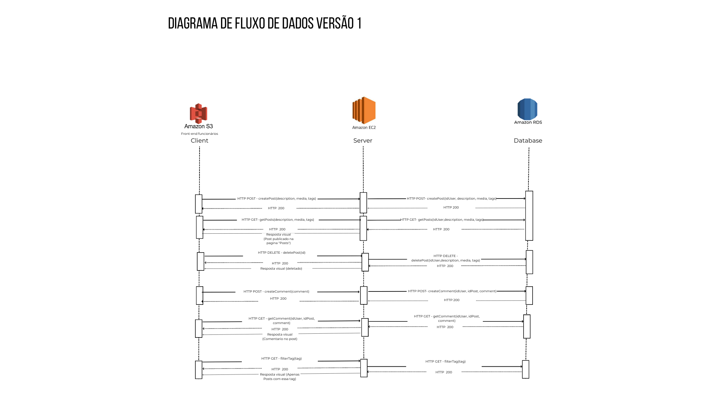
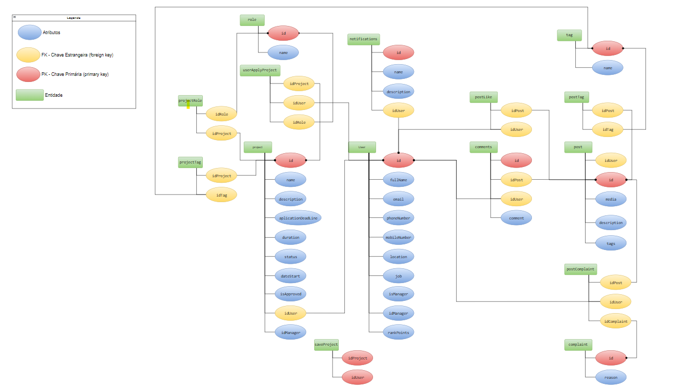
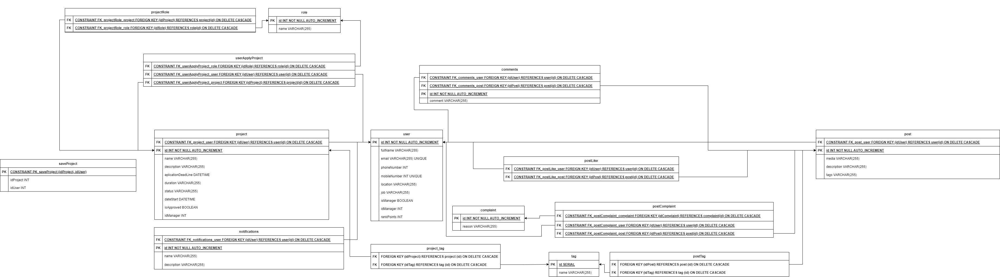
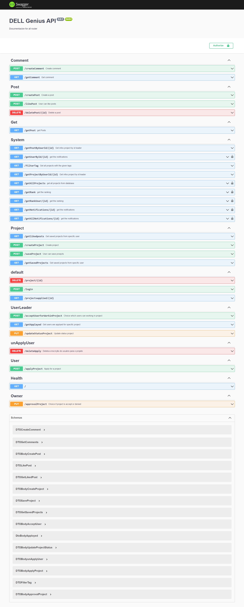

<table>
<tr>
<table>
<tr>
<td>

</td>
<td>
</td>
</tr>
</table>

**Nome do Projeto**: App Dispositivo Móvel
	
**Nome do Parceiro**:  Dell Technologies
	
**Nome do Grupo**: Dell Genius
	
**Integrantes do grupo**
<ul>
	<li>Ana Clara Loureiro Muller Zaidan</li>
	<li>Daniel Cunha</li>
  	<li>Jordan Andrade</li>
  	<li>Luísa Leite</li>
  	<li>Pedro Gattai</li>
 	<li>Wagner Estevam</li>
</ul>

**Módulo 6 - Engenharia de Software**
	
**APP Dispositivo Móvel**

**Conteúdo**

- [Visão Geral do Projeto](#visão-geral-do-projeto)
  - [Parceiro de Negócios](#parceiro-de-negócios)
  - [Problema](#problema)
    - [Análise do Problema](#análise-do-problema)
    - [Matriz de avaliação de valor Oceano Azul](#matriz-de-avaliação-de-valor-oceano-azul)
    - [Proposta de Valor e Value Proposition Canvas](#proposta-de-valor-e-value-proposition-canvas)
    - [Matriz de Risco](#matriz-de-risco)
    - [Análise financeira do projeto](#análise-financeira-do-projeto)
    - [Mapeamento do processo](#mapeamento-do-processo)
  - [Descritivo da Solução](#descritivo-da-solução)
    - [Objetivos](#objetivos)
      - [Objetivos gerais](#objetivos-gerais)
      - [Objetivos específicos](#objetivos-específicos)
    - [Justificativa](#justificativa)
  - [Partes Interessadas](#partes-interessadas)
- [Requisitos](#requisitos)
  - [Requisitos Funcionais](#requisitos-funcionais)
  - [Requisitos não Funcionais](#requisitos-não-funcionais)
  - [Perfis de Usuários](#perfis-de-usuários)
  - [Casos de Uso](#casos-de-uso)
- [Arquitetura do Sistema](#arquitetura-do-sistema)
- [UX e UI Design](#ux-e-ui-design)
  - [Wireframes](#wireframes)
  - [Design de Interface - Guia de Estilos](#design-de-interface---guia-de-estilos)
- [Projeto de Banco de Dados](#projeto-de-banco-de-dados)
  - [Modelo Conceitual](#modelo-conceitual)
  - [Modelo Lógico](#modelo-conceitual)
- [Testes de Software](#testes-de-software)
  - [Teste Unitário](#teste-unitário)
  - [Teste de Integração](#teste-de-integração)
  - [Teste de Regressão](#teste-de-regressão)
  - [Teste de Usabilidade](#teste-de-usabilidade)
  - [Teste de Funcionalidade](#teste-de-funcionalidade)
  - [Teste de API](#teste-de-api)
- [Documentação da API](#documentação-da-api)
- [Manual do Usuário](#Manual-do-usuário)
- [Referências](#referências)
- [Apêndice](#apêndice)

# Visão Geral do Projeto
	

## Parceiro de Negócios

A Dell é uma empresa que foi criada em 1984 com o objetivo de oferecer acesso fácil à melhor tecnologia em todos os lugares do planeta. Estão entre as maiores empresas de tecnologia do mundo, sendo líder no mercado de computadores pessoais, servidores, dispositivos de armazenamento, soluções de segurança e soluções de rede, atuando com diversos recursos extraordinários . As aplicações da Dell vão desde soluções de nuvem híbrida e computação de alto desempenho até iniciativas de impacto social e sustentabilidade.

## Problema

O problema identificado no projeto é a retenção de talentos dentro da Dell. Na empresa, alguns profissionais estão saindo da empresa por não estarem se sentindo desafiados, não estarem tendo oportunidades de ganhar novos conhecimentos e não se sentirem engajados e motivados.

### Análise do Problema

Como o problema está centrado na falta de engajamento e motivação dos funcionários em relação à Dell, urge que uma solução seja construída com base nesse óbice. Dessa forma, foi pensado como paliação um sistema que oferecesse e entregasse conteúdos que fizessem com que os funcionários pegassem o celular fora do horário de trabalho, fazendo com que eles queiram participar de projetos da empresa e que queiram aprender novos assuntos. Um dos benefícios esperados é a otimização do processo de seleção de tópicos interessantes por meio do sistema de recomendação. Outro benefício esperado é o aumento da transparência e comunicação entre os colaboradores, permitindo troca de feedbacks e críticas construtivas. 

### Matriz de avaliação de valor Oceano Azul

Definir 8 atributos que são importantes para os clientes e diferenciá-los da concorrência por meio das ações de Reduzir, Eliminar, Aumentar e Criar.

### Proposta de Valor e Value Proposition Canvas

Idea as we understand it: Dell employees want to learn a new skill. They can do this in the form of a project. They can create their own project or join an existing project. The project is outside of their regular work schedule. The employees can collaborate together to stimulate personal and professional growth.

#### Customer Profile
<bold>Gains – the benefits which the customer expects and needs, what would delight customers and the things which may increase likelihood of adopting a value proposition.</bold>
	<li>Being able to learn in an interactive and collaborative way</li>
	<li>Getting access to insider knowledge from colleagues </li>
	<li>Exploring new skills and fun projects</li>
	

<bold>Pains – the negative experiences, emotions and risks that the customer experiences in the process of getting the job done.</bold>
	<li>Learning through books is boring and often contains outdated information
 </li>
	<li>Being able to come up with a fun project to work on is hard
 </li>
	<li>Not being motivated to work on your project
 </li>
	

<bold>Customer jobs – the functional, social and emotional tasks customers are trying to perform, problems they are trying to solve and needs they wish to satisfy.</bold>
	<li>Satisfying your own need to grow and learn as a person </li>
	<li>Contributing to the growth of your cherished colleagues
 </li>
	<li>Getting rid of the feeling of feeling stuck in your own job
 </li>
	

	
#### Value Proposition
Gain creators – how the product or service creates customer gains and how it offers added value to the customer.
	<li>Providing an easy to use platform where personal goals are matched with interesting projects
 </li>
	<li>Linking up with valuable colleagues to learn from/teach to
 </li>
	<li>Satisfying your own curiosity as to what colleagues are doing by reading up on their project (i.e. devblog)
 </li>
	

Pain relievers – a description of exactly how the product or service alleviates customer pains.
	<li>Getting rid of old teaching techniques and adopting a ‘boots on the ground’ (practical) approach through collaboration
 </li>
	<li>Getting inspired to join a project or to start your own project </li>
	<li>Implementing gamification (i.e. points, streaks, rewards, customizability, cosmetics), setting personal goals, making it easy to use, fun and having an accountability partner </li>
	

Products and services – the products and services which create gain and relieve pain, and which underpin the creation of value for the customer.
	<li>Dell employees can easily join the app, see existing projects, get inspired to join a project or make their own project
 </li>
	<li>Dell employees can contribute to a project and earn points </li>
	<li>Dell employees can track their own growth so they can be proud of their achievements </li>
	
### Matriz de Risco

1- O escopo do projeto ficar muito aberto, dificultando o alcance do objetivo principal.

2- A aplicação ficar indisponível para o usuário na maior parte do tempo.

3- Não conseguir desenvolver uma aplicação iterativa que engaje o usuário.

4- Acontecer um vazamento de dados dos usuários.

5- Não conseguir entregar todas as funcionalidades dentro do prazo estipulado.

6- Enfrentarmos limitações nos recursos disponíbilizados pelo Inteli da AWS.

7- O grupo não conseguir desenvolver todas as habilidades necessárias para avançar no aprendizado.

8- Melhorar nossas habilidades em Cloud Computing.

9- Falta de comunicação nos membros da equipe causando retrabalhos e falhas na execução do projeto.

10- Problemas de compatibilidade entre diferentes sistemas operacionais e dispositivos, o que pode dificultar a usabilidade da aplicação pelos usuários.

11- Falta de testes adequados, levando a erros e bugs na aplicação.

12- Dificuldades técnicas durante o desenvolvimento, como a integração de APIs ou o uso de bibliotecas específicas.

13- Falta de clareza nas especificações e requisitos do projeto, resultando em ambiguidade e confusão entre os membros da equipe.

14- A oportunidade de criar uma solução inovadora que geraria um grande impacto na empresa DELL.

### Análise financeira do projeto

Uma vez que o nosso projeto é destinado exclusivamente ao uso interno pelos funcionários, não dispomos de dados de receita estimada, já que não haverá vendas envolvidas. O resultado que pretendemos alcançar com este projeto é aumentar o engajamento e a motivação dos colaboradores, o que deve resultar em melhorias na qualidade da entrega e na retenção de talentos, reduzindo a rotatividade de funcionários na empresa.
Mas em relação a projeção de custos, temos:
- **Serviços de nuvem**: O custo dos serviços da AWS pode variar significativamente dependendo do número de usuários da plataforma, que no caso são os funcionários da DELL, e do tempo de uso. Quando se contrata um serviço da AWS, não há uma taxa fixa mensal, mas sim uma cobrança baseada no uso dos serviços. Resumindo, o preço pode variar de acordo com o tipo de serviço, a região geográfica e o tempo de uso.
No entanto, os serviços básicos da AWS que são obrigatórios para hospedar um site são a instância EC2 (para o back-end), RDS (para o banco de dados) e S3 (para o front-end). Supondo que vamos usar o EC2 na região Norte da Virgínia com o t2.micro, o valor é de US$ 0,0116 por hora. Usando esse serviço durante 24 horas por dia e sete dias por semana durante um ano, o valor seria de **US$ 101,61**. No entanto, os preços podem variar de acordo com a demanda e a disponibilidade de capacidade.
Para o RDS com 10 GB de armazenamento e 100.000 leituras/gravações por mês com o MySQL, o preço começa em US$ 0,017 por hora para instâncias de banco de dados de tamanho pequeno. Supondo que usemos esse serviço durante um ano, 24 horas por dia e sete dias por semana, o valor seria de **US$ 148,92**.
Quanto ao S3 na região Norte da Virgínia, o preço começa em US$ 0,023 por GB/mês para armazenamento e US$ 0,09 por GB para transferência de dados de saída. Usando esses preços como base, o custo anual para 10 GB de armazenamento e 100GB de transferência de dados seria de cerca de **US$ 27,60**.
Juntando os valores estimados dos três serviços, o custo anual seria de **US$ 278,13**.
- **Custos com a Manutenção**: Depois da entrega do projeto, que é um MVP (Minimum Viable Product), ou seja, um protótipo, é importante que ele passe por melhorias e manutenção contínuas. Esse processo demandará uma equipe especializada em front-end, back-end e infraestrutura. Pois a manutenção contínua de um projeto é essencial para seu sucesso, além de permitir a implementação de novas funcionalidades e melhorias ao longo do tempo. Por isso, é fundamental contar com uma equipe de profissionais especializados e comprometidos com o sucesso do projeto.
- **Custos com a escalabilidade**: Conforme cresce o número de usuários o preço para armazenar o banco de dados e o site cresce também, ou seja, devemos considerar um valor para escalabilidade. Até mesmo porque a DELL é uma empresa mundial com 133 mil funcionários.
- **Distribuição**: Para o acesso dos funcionários a aplicação é preciso contratar um serviço de distribuição, e ele pode ser o Android Enterprise que é um programa desenvolvido pela Google para facilitar o uso de dispositivos móveis e aplicativos para sistemas Android no ambiente corporativo.  Em relação ao valor ele pode variar muito dependendo do provedor de serviços e das funcionalidades específicas que é necessária. Geralmente, é oferecido como um serviço de assinatura com preços diferentes de acordo com o número de dispositivos gerenciados e o nível de suporte necessário. 
	Em relação ao gasto com a criação do MVP, não existem custos, pois a empresa DELL tem uma parceria com o Inteli para criação de 6 MVPs feitos pela sala de engenharia de software de forma gratuita. Mas levando em conta que esse serviço de criação da aplicação fosse pago a empresa precisaria de desenvolvedores back-end, front-end e DevOps. Com base nos salários oferecidos no mercado para essas vagas segue tabela de preços:

| Cargo | Salário |
| ------ | ------ |
| Desenvolvedor Back-end Sênior | R$ 10.483,00 |
| Desenvolvedor Back-end Júnior | R$ 3.355,00 |
| Desenvolvedor Front-end Sênior | R$ 10.095,00 |
| Desenvolvedor Front-end Júnior | R$ 3.000,00 |
| UX/UI | R$ 6.169,00 |
| Desenvolvedor DevOps Sênior | R$ 10.581,00 |
| Desenvolvedor DevOps Júnior | R$ 4.046,00 |
| **Total** | **R$ 47.729,00** |

Somando o total dos salários o valor é R$ 47.729,00 por mês, ao ano o valor vai para R$ 572.748,00. Mas considerando que vamos contratar esses esses desenvolvedores por somente 3 meses para desenvolver a aplicação o valor é de **R$143.187,00**. 

Resumindo todos os custos, temos essa tabela:
| Custos | Valor |
| --- | --- |
| Serviços de Nuvem | US$ 278,13 convertendo esse para real é **R$ 1.384,39** |
| Salários | O valor de três meses de salários dos desenvolvedores é  **R$143.187,00** |
| Total | **R$ 144.571,39** |

## Mapeamento do processo

O mapeamento de processos é uma técnica de gestão que tem como objetivo descrever, de forma detalhada, todas as etapas de um processo de negócio. Esse processo pode ser qualquer atividade que faz parte das operações de uma organização, desde a produção de um produto até o atendimento ao cliente.
O mapeamento de processos envolve a criação de um mapa ou fluxograma que ilustra todas as etapas do processo, bem como as interações entre elas. Dessa forma, foram elaborados pelo time de desenvolvimento alguns desses fluxogramas que contém as etapas das funcionalidade principais da aolução desenvolvida. O objetivo dessa ação, é facilitar a visualização holística de todo o projeto e identicar possíveis inconsistências, oportunidades de melhoria das funcionalidades e oportunidades de otimização do processo. A seguir, seguem anexados os fluxogramas criados:

## Descritivo da Solução

A solução envolve a construção de um sistema de recomendação a partir de bases rotuladas de projetos e documentários fornecidos pelos colaboradores. Os usuários poderão criar e também interagir com conteúdos criados por outras pessoas, podendo fazer comentários, curtir, descurtir, dar match com as postagens e pedir para participar deles. Ademais, existirá a possibilidade de denunciar conteúdos que infrinjam as diretrizes da empresa e de visualizar uma FAQ(Frequently Asked Questions). Soma-se, ainda, o fato de poderem ver sua posição no ranking da empresa de acordo com seu engajamento no sistema.

### Objetivos

	
#### Objetivos gerais

O objetivo desta iniciativa é fomentar a retenção de talentos dentro da empresa Dell por meio do incentivo e aprendizagem de forma diferenciada.

#### Objetivos específicos

Como objetivos específicos, espera-se que a solução aumente o engajamento dos funcionários e faça com que eles se sintam motivados a pegarem o celular fora do horário de trabalho, fazendo com que eles se sintam cada vez como parte da empresa.

### Justificativa

A plataforma será desenvolvida na arquitetura de nuvem chamada IaaS (Insfrastructure as a Service), pois ela elimina a necessidade de investimento, monitoramento e manutenção em servidores locais. Dentre os diversos benefícios de se utilizar o IaaS, pode-se citar a eliminação de uma grande quantia de custos de capitais, a redução de custos contínuos, o aprimoramento da continuidade dos negócios, o aprimoramento da recuperação de desastres, a possibilidade de respostas mais rápidas às condições de negócios em mudança, o fornecimento de novos aplicativos para usuários com mais rapidez e a diminuição das chances de indisponibilidade.
Dessa forma, foi definido que a parte de front-end (client) da aplicação, ou seja, aquela que o usuário tem contato direto, será armazenada na Amazon S3, uma vez que essa hospeda sites estáticos, idealmente para aqueles que possuem script apenas na parte do cliente (AMAZON, 2023). Outrossim, usaremos o serviço Amazon CloudFront, que acelera a distribuição do conteúdo estático e dinâmico da web. Além disso, tanto para o back-end, quanto para o banco de dados, será usado para armazená-los a Amazon EC2, uma vez que essa aceita o dinamismo que essas áreas da aplicação exigem.

## Partes Interessadas 

Descrever os principais stakeholders envolvidos no projeto e seus papéis.

# Requisitos

Esta seção é importante porque permite que os desenvolvedores entendam claramente o que é esperado do software e quais serão as restrições e desafios enfrentados durante o desenvolvimento. Além disso, permite que os usuários finais saibam se o software atende às suas expectativas e se está adequado ao seu ambiente de trabalho.

A seção de requisitos do sistema é atualizada constantemente durante o ciclo de desenvolvimento do software, garantindo que todas as necessidades e especificações estejam sempre atualizadas.

## Requisitos Funcionais
	
Sabendo que se define por “Requisitos Funcionais“ aqueles que incluem informações sobre as funcionalidades esperadas do software, além de restrições e limitações do sistema. São compostos por duas partes: função (que se refere ao que o sistema faz) e comportamento (que refere-se como o sistema faz isso) (VISURE, 2023). Dessa forma, viu-se a necessidade de elencar esses, de acordo com a solução.

FR-01: A página inicial do aplicativo deve ter uma lista de conteúdos disponíveis para os usuários interagirem

FR-02: A página inicial do aplicativo deve ter uma barra de busca para encontrar documentários e projetos específicos

FR-03: O aplicativo deve conter um sistema de recomendação com base nas curtidas do usuário

FR-04: Os usuários devem conseguir publicar, editar e excluir projetos criados

FR-05: Os usuários devem poder pedir para participar de um projeto

FR-06: Os usuários devem ser capazes de fazer comentários/sugestões nos conteúdos

FR-07: Os usuários devem ter um perfil onde vejam todos os seus conteúdos publicados, sendo capazes de visualizar o histórico de criação

FR-08: Sistema deve poder premiar os criadores de conteúdo por meio de badges, bem como ranking de top criadores de conteúdo

FR-09: O sistema deve ter um filtro de palavras e expressões

FR-10: O sistema deve ter tutoriais e um FAQ de como criar e se inscrever nos projetos e como submeter a recomendação de um documentário 

FR-11: O sistema deve ser capaz de notificar os usuários sobre novos conteúdos disponíveis, edições feitas em seus próprios conteúdos ou interações em seus conteúdos

FR-12: O sistema deve ter um modo escuro

FR-13: A solução deve contemplar integração com sistemas internos de single sign on (SSO)

FR-14: A aplicação deve ser feita toda em inglês

FR-15: O sistema deve ser interno, funcionar apenas para os funcionários da DELL

FR-16: O sistema deve permitir que o usuário curta e descurta conteúdos, tais como conteúdos a fim de expressar sua opinião e interagir com outros usuários.

FR-17: O sistema deve ter a possibilidade de editar ou excluir um comentário feito em alguma publicação

FR-18: O sistema deve rotular conteúdos através de tags para facilitar o sistema de recomendação e interagir com as tags dos projetos para auxiliar o sistema de match.

FR-19: O sistema deve possuir uma área disponível apenas ao(s) moderador(es).

FR-20: O sistema deve ter uma ferramenta de feedback e avaliação do aplicativo.

FR-21: No sistema deve ter o botão “NON-COMPLIANT” em cada conteúdo que funcionará como uma forma de denunciar conteúdo. 

FR-22: O moderador poderá excluir conteúdos que foram denunciados.
	

## Requisitos não Funcionais

Os requisitos não funcionais referem-se aos atributos de qualidade do sistema. Geralmente, esses são indicados com adjetivos de desempenho, segurança e escalabilidade. Para a aplicação em questão foram elencados os seguintes requisitos:

NFR-01:  A aplicação deve ter uma interface de usuário intuitiva e fácil de navegar
 
NFR-02:  A solução deve ter um design limpo seguindo o design system da empresa

NFR-03:  O aplicativo mobile deve ser responsivo para ficar funcional tanto em celulares quanto tablets

NFR-04: O sistema deve ser resistente a falhas

NFR-05: O sistema deve mostrar feedbacks constantes sobre o andamento do uso do aplicativo para os usuários

NFR-06: O sistema deve ser de fácil manutenção e ter uma boa escalabilidade

NFR-07: A solução deve estar majoritariamente disponível, ou seja, estar sempre acessível ao usuário 

NFR-08: O aplicativo deve ser interativo e engajante, para que o funcionário da DELL se sinta encorajado a usar o app fora do trabalho

NFR-09: O sistema deve proteger os dados do usuário, seguindo a LGPD

	
## Relação do 12-Factor App e Requisitos

	

## Perfis de Usuários 

A seção de perfil de usuário da documentação de software é responsável por descrever instruções detalhadas sobre o uso de cada opção e recursos relacionados ao perfil do usuário, garantindo uma experiência fácil e intuitiva para o usuário final.

## Casos de Uso

Neste projeto, para aprendermos mais sobre o fluxo do usuário, aplicamos as técnicas de User Stories e Casos de uso. Os dois têm como principal objetivo resumir os detalhes do usuário no sistema e suas interações com ele.

As User Stories seguem um modelo base, contendo os seguintes elementos:

PERFIL: perfil do usuário que realizará a ação

DEVO/POSSO: obrigatoriedade da ação

AÇÃO: o que será realizado

OBJETIVO: qual a finalidade da ação.

Formando a frase: Como PERFIL, DEVO/POSSO AÇÃO para OBJETIVO

Para o diagrama dos casos de uso, criamos três atores: um administrador, um moderador e um funcionário Dell, que seria o usuário principal. Depois, inserimos as ações e intenções de cada um no sistema.
	

	

	

	
01 - Como usuário da aplicação, posso publicar um projeto para que outras pessoas vejam
	
02 - Como líder do projeto, posso editar um projeto que criei para alterar alguma informação equivocada

03 - Como usuário do aplicação, posso denunciar uma publicação que considero imprópria na plataforma para garantir que as diretrizes do aplicativo sejam cumpridas.

04 - Como moderador da plataforma, posso validar ou excluir uma publicação para manter os conteúdos de acordo com as diretrizes e normas especificadas.

05 - Como colaborador, posso visualizar um feed com posts de conteúdo relevante ao meu perfil, para explorar assuntos e tecnologias do meu interesse.

06 - Como colaborador, posso buscar por projetos a partir de palavras chave (tags), para encontrar projetos específicos.

07- Como funcionário da Dell logado no aplicativo, posso curtir ou descurtir  um projeto recomendado para indicar meu interesse em participar da atividade ou o interesse em não participar, respectivamente;
	
08- Como líder de um projeto, posso aprovar ou desaprovar uma uma solicitação de participação no meu projeto para selecionar aqueles que mais se adequam ao perfil procurado para a atividade;

09 - Como usuário quero que a plataforma me ofereça uma explicação de como fazer o uso das aplicações disponíveis nela, para que não exista dificuldades de usar a plataforma e melhorar minha experiência;

10 - Como usuário quero poder avaliar o aplicativo e dar sugestões para o desenvolvimento do próprio aplicativo;
	
11 - Como manager quero ter a possibilidade de aprovar ou rejeitar um projeto proposto por algum dos meus funcionários, para que o projeto fique disponível na plataforma.
	
12 - Como usuário desejo comentar nas publicações como também editar e excluir meu comentário caso necessário, para que seja possível passar feedback sobre os projetos e publicações feitas na plataforma.
	
13 - Como usuário desejo me inscrever em projetos, para que eu possa aprender com eles
	
14 - Como usuário desejo que a plataforma me recomende postagens relacionadas a publicações das quais já interagi, para fazer com que eu me engaje mais com a plataforma.
	
15- Como usuário, desejo poder ver meu perfil e todas as minhas ações já feitas dentro da plataforma, para que eu tenha acesso a tudo que já fiz na plataforma.
	
16-Como usuário desejo ter uma experiência gamificada dentro da plataforma da qual me proporciona recompensas, para que eu me engaje mais com a plataforma.
	
17-Como usuário desejo receber notificações da plataforma, para estar atualizado do quem vem ocorrendo na plataforma.
	
18-Como usuário desejo fazer login com minha conta da DELL, para facilitar meu login na plataforma.

## Matriz de Rastreabilidade
### Requisitos Funcionais e Não Funcionais

	
### Casos de Uso
	

	
### Matriz de Rastreabilidade
	

Segue o link do sheets para análise detalhada da matriz de rastreabilidade: https://docs.google.com/spreadsheets/d/1h7dybGE_3WqlJQOYH61XaNoXmFmM-0_dJddb_wh2OYs/edit?usp=sharing
		

# Arquitetura do Sistema

## Arquitetura - Versão 1

link do design da arquitetura da nuvem em PDF: https://github.com/2023M6T3-Inteli/Grupo-1/blob/main/docs/img/arquitetura%20g1m6.pdf

Link do design da arquitetura da nuvem no Miro: https://miro.com/app/board/uXjVMRQR27k=/?share_link_id=321002910734

## Arquitetura - Versão 2
Na segunda versão da Arquitetura da Solução, adicionamos a tecnologia de mensageria Kafka.

link do design da arquitetura da nuvem em PDF: https://github.com/2023M6T3-Inteli/Grupo-1/blob/main/docs/img/arquitetura2.pdf

Link do design da arquitetura da nuvem no Miro: https://miro.com/app/board/uXjVMRQR27k=/?share_link_id=321002910734

## Arquitetura - Versão 3
Na terceira versão, adicionamos o serviços AWS Glue e AWS Redshift.

Link do design da arquitetura da nuvem no Miro: https://miro.com/app/board/uXjVMDmTIZ0=/

## Arquitetura do sistema de mensageria

canvas: https://www.canva.com/design/DAFi8xkYJf4/D-8njrz19fpwz4vlDU8BCQ/edit?utm_content=DAFi8xkYJf4&utm_campaign=designshare&utm_medium=link2&utm_source=sharebutton

A arquitetura de mensageria, que usa o Apache Kafka, tem como principais vantagens a capacidade de escalabilidade do sistema e desempenho, isso faz com que seja possivel  aumentar e diminuir facilmente o numero de Brokers disponiveis na aplicação para se adequar ao tanto de usuarios que estão fazendo uso do sistema, com esse sistema há tambem a capacidade de lidar com milhões de mensagens ao mesmo tempo em baixa latencia, aumentando o desempenho da aplicação. Como nossa arquitetura conta com um Load Balancer para balancear o envio de dados ao sistema de mensageria conseguimos fazer com que o sistema distribua esses dados para diferentes Brokers do serviço de mensageria, fazendo com que o sistema consiga processar os dados mesmo sofrendo um ataque DDoS.

# UX e UI Design

Aborda o design e a funcionalidade da aplicação ou sistema em questão. Ela fornece informações sobre como o software é projetado para ser fácil de usar e intuitivo para os usuários. Nesta seção, deve ser possível encontrar descrições detalhadas sobre as principais características e recursos da interface do usuário, como botões, menus, ícones e outros elementos que são utilizados para facilitar a interação do usuário com o software. Além disso, são fornecidos exemplos de como as funcionalidades do software são acessadas e usadas pelos usuários, incluindo informações sobre os passos necessários para realizar tarefas específicas. Esta seção também aborda as principais preocupações de UX, como acessibilidade, usabilidade, consistência e simplicidade. São apresentados exemplos de como o software é projetado para atender às necessidades dos usuários com diferentes tipos de habilidades e recursos.

## Benchmark e Revisão de Design Systems

Link do Benchmark e Revisão de Design Systems em PDF: https://github.com/2023M6T3-Inteli/Grupo-1/blob/main/docs/Benchmark_Design_System.pdf
Link do Benchmark e revisão de Design Systems no Google Sheets: https://docs.google.com/spreadsheets/d/10xqS13fX90MrVT1yV-PZNmlSNg-UNKO5x1Zj6QJq6vg/edit?usp=sharing

## Wireframes / Prototipação

O protótipo foi desenvolvido com a ferramenta Figma, e pode ser visualizado através do seguinte link: https://www.figma.com/file/PZw7A4hfUjc0dphS2dZKTD/G1M6T3?node-id=3%3A4&t=Djr2Ab8i69ufcL2k-1

## Design de Interface - Guia de Estilos
Refere-se ao design visual, cores, tipografia, imagens, logotipos, ou seja, os elementos visuais que compõem o produto.
Aqui você deve colocar o link para seu documento de guia de estilos.
	
O Guia de Estilos foi desenvolvido com a ferramenta Figma, baseado nas Foundations do Design System da Dell Technologies, e pode ser visualizado através do seguinte link: https://www.figma.com/file/PZw7A4hfUjc0dphS2dZKTD/G1M6T3?node-id=91%3A4553&t=Djr2Ab8i69ufcL2k-1

# Projeto de Banco de Dados

Documento contendo diagrama de entidades e relacionamentos do banco de dados

## Modelo Conceitual

O modelo conceitual deve garantir uma conexão com a realidade. Os 4 tipos de conexões com a realidade são:
conceitos
atributos
identificações
associações
O Modelo Entidade-Relacionamento - MER
entidades e tipos de entidades
atributos e tipos de atributos
relacionamentos e tipos de relacionamentos

## Modelo Lógico 

O modelo lógico de banco de dados é uma representação abstrata e simplificada dos dados armazenados no sistema. É utilizado para entender como os dados são relacionados e para garantir a integridade e consistência dos dados armazenados. Incluir  uma descrição detalhada das tabelas, campos e relações presentes no modelo lógico de banco de dados. Também serão apresentadas as regras de negócio e as restrições aplicadas aos dados para garantir a integridade e a consistência dos dados armazenados.

# Pipeline de dados

Uma pipeline de dados é um conjunto de etapas interconectadas e automatizadas para processar, transformar e mover dados de uma fonte para um destino específico. É um conceito comum em ciência de dados, engenharia de dados e análise de dados.

Uma pipeline de dados geralmente consiste em várias etapas sequenciais que permitem a coleta, o processamento, a transformação e a carga dos dados em um formato útil para análise, armazenamento ou visualização. Essas etapas podem incluir a extração de dados de várias fontes, a limpeza e transformação dos dados, a aplicação de algoritmos de análise, a integração com outros sistemas e, finalmente, a entrega dos dados em um destino desejado.

## Fonte de dados

1. Base de dados: A fonte da pipeline de dados é um conjunto de dados obtido do site Kaggle, um renomado repositório online de conjuntos de dados. Especificamente, o conjunto de dados utilizado está armazenado em formato CSV (Comma-Separated Values), um formato amplamente utilizado para representar dados tabulares. Ao lidar com um arquivo CSV, existe a vantagem de trabalhar com dados organizados em formato de tabela, com colunas representando diferentes atributos e linhas representando registros individuais. Essa estrutura tabular permite que você acesse e manipule facilmente os dados usando técnicas e ferramentas adequadas.

2. Amazon MSK (Managed Streaming for Apache Kafka): Utilizaremos dados provenientes do Amazon MSK, que é um serviço gerenciado da Amazon Web Services para Apache Kafka, uma plataforma de streaming distribuído. O Apache Kafka é usado para processamento em tempo real de fluxos de dados. A frequência de atualização dependerá da taxa de produção de eventos no tópico do Kafka e da configuração da pipeline para consumir esses eventos. O volume de dados dependerá da quantidade de eventos produzidos no tópico do Kafka.

## Extração, Transformação e Carregamento

Vale ressaltar que o método que usaremos para a extração dos dados é da extração completa, pois nesse método, todos os dados da fonte de dados são extraídos em cada execução do processo de ETL, garantindo que todos os dados estejam atualizados e não ocorram inconsistências.  Soma-se, ainda, o fato de que a estratégia de carga escolhida é a de substituição completa, visto que todos os dados existentes no destino são substituídos pelos novos dados extraídos, sendo muito útil quando precisamos garantir que os dados no destino estejam sempre sincronizados com a fonte.

1. Base de dados:

Após baixar o conjunto de dados do Kaggle, foi realizado um processo de pré-processamento para garantir a qualidade e a integridade dos dados, utilizando o Google Colab e fazendo o uso das bibliotecas Pandas e Numpy. Escrevemos um código para a remoção de valores ausentes.

Além disso, removemos a coluna “timestamp”, pois ela não seria necessária para nossa análise. Com isso, extraímos os dados nas três primeiras colunas e começamos o processo de transformação, manipulando-os e formatando-os para gerar uma distribuição visual das classificações presentes no conjunto de dados. A seguir, descrevo abaixo as operações realizadas para a transformação dos dados:

Importação das bibliotecas necessárias: pandas, seaborn e matplotlib.pyplot.

Carregamento dos dados a partir de um arquivo CSV utilizando a função pd.read_csv() do pandas. Os dados são armazenados na variável dados.

Contagem do número de amostras em cada classe. É realizada a contagem dos valores únicos da coluna 'classification' utilizando o método value_counts() e os resultados são armazenados na variável contagem_classes.

Configuração do estilo do gráfico usando a função sns.set() do seaborn.

Plotagem de um gráfico de barras utilizando a função sns.barplot(). Os valores no eixo x correspondem às diferentes classes presentes na coluna 'classification', enquanto os valores no eixo y correspondem à contagem de cada classe.

Configuração de rótulos e título para o gráfico usando as funções plt.xlabel(), plt.ylabel() e plt.title() do matplotlib.

Rotação dos rótulos no eixo x, se necessário, usando a função plt.xticks(rotation=45).

Exibição do gráfico usando a função plt.show().

Para a etapa de carregamento, escolhemos o Amazon Redshift, que é um serviço de data warehousing baseado em nuvem, projetado especificamente para processar grandes volumes de dados. Ele oferece capacidades de armazenamento, consulta e análise de dados escaláveis e eficientes. Para carregar os dados no Amazon Redshift, seguiremos os seguintes passos:

Criar um cluster do Amazon Redshift: iniciaremos um cluster do Redshift na AWS. Isso envolve definir as configurações adequadas, como tamanho do cluster, número de nós, tipo de instância, entre outros.

Criar uma tabela no Amazon Redshift: No cluster do Redshift, criaremos uma tabela com a estrutura adequada para armazenar os dados. Definiremos os tipos de dados, as restrições, etc.

Preparar os dados transformados: Antes de carregar os dados no Redshift, pode-se precisar fazer ajustes adicionais para garantir que eles estejam formatados corretamente e correspondam à estrutura da tabela criada.

Carregar os dados: utilizaremos as ferramentas e métodos disponíveis para carregar os dados no Redshift. Existem várias opções, como o uso da ferramenta COPY para carregar arquivos CSV diretamente do armazenamento S3, ou o uso de bibliotecas e APIs específicas para a linguagem de programação que estamos usando

2. Amazon MSK:

Como estamos construindo nossa pipeline no formato ETL (Extração, Transformação e Carga), o serviço que utilizaremos para utilizar dados do Amazon MSK é o AWS Glue. O AWS Glue é um serviço totalmente gerenciado que facilita a preparação e a carga de dados para análise. Para isso, realizaremos os seguintes passos:

A - Configuração do conector do MSK: No AWS Glue, precisa-se configurar um conector para o Amazon MSK. Isso envolve fornecer detalhes como os pontos de extremidade do cluster do MSK, o tópico a ser consumido e as credenciais de acesso necessárias.

B - Definição do crawler: É necessário definir um crawler no AWS Glue para criar o catálogo de metadados para os dados provenientes do MSK. O crawler analisa o tópico especificado e cria tabelas virtuais correspondentes no catálogo do AWS Glue.

C - Configuração do catálogo do Glue para o MSK: Após definir o crawler, é preciso configurar o catálogo do Glue para interagir com o Amazon MSK, fornecendo informações como os detalhes de conexão do MSK, como ponto de extremidade, porta, tópico, grupo de consumo, etc.

D - Mapeamento dos dados: Após o crawler criar o catálogo de metadados, pode-se mapear os dados extraídos para o formato desejado. Essa etapa inclui transformações de dados, como renomear colunas, converter tipos de dados, filtrar registros, adicionar colunas derivadas, entre outras operações.

E - Criação do job de transformação: Com o mapeamento dos dados definido, cria-se um job no AWS Glue para executar a transformação dos dados provenientes do MSK. O job especifica a origem (tabela virtual criada pelo crawler) e o destino dos dados, como um bucket do Amazon S3, uma base de dados do Amazon Redshift ou outro destino compatível.

F - Configuração das transformações: Dentro do job, configura-se às transformações a serem aplicadas aos dados. O AWS Glue oferece um ambiente visual e orientado ao fluxo de trabalho para definir as transformações usando operações pré-definidas, como filtro, mapeamento, agregação, classificação, união, entre outras. Também é possível escrever código em Python ou Scala para transformações mais avançadas.

G - Execução do job de transformação: Após configurar as transformações, pode-se executar o job no AWS Glue. Durante a execução, o AWS Glue distribui o processamento dos dados de forma escalável, lidando com a divisão de tarefas e otimizando o desempenho.

H - Monitoramento e validação: Durante a execução do job, é possível monitorar o progresso e verificar se os dados transformados estão corretos. O AWS Glue oferece recursos de monitoramento, logging e alertas para acompanhar a execução do job e identificar problemas, se houver.

I - Carregamento dos dados transformados: Uma vez que o job de transformação seja concluído com sucesso, os dados transformados podem ser carregados no destino especificado, como um bucket do Amazon S3, uma base de dados do Amazon Redshift ou outro destino compatível.

## Segurança

Autenticação e autorização: Usaremos as funcionalidades de autenticação e autorização do Amazon Redshift para garantir o acesso adequado aos dados. Criaremos usuários e grupos com as permissões apropriadas, garantindo que cada membro da equipe tenha acesso somente ao necessário para realizar suas tarefas

Criptografia de dados: Consideramos utilizar criptografia para proteger os dados em trânsito e em repouso no Amazon Redshift. Podemos habilitar a criptografia SSL para conexões de rede e a criptografia de disco para dados armazenados no cluster do Redshift.

## Escalabilidade e Desempenho

Configuração do cluster: Podemos configurar o tamanho e o tipo de instância do cluster do Amazon Redshift com base nas necessidades de escalabilidade e desempenho. 

# Testes de Software

## Teste Unitário
Seguem os testes unitarios de cada rota disponivel na aplicacao, duas delas estao contendo erros e os erros receberam solucoes na Sprint 5

## Teste de Integração

Link ou imagem da tabela com dados organizados dos testes realizados.

## Teste de Regressão

Link ou imagem da tabela com dados organizados dos testes realizados.

## Teste de Usabilidade 

Link ou imagem da tabela com dados organizados dos testes realizados.

## Teste de Funcionalidade 

Link ou imagem da tabela com dados organizados dos testes realizados.

## Teste de API 

Link ou imagem da tabela com dados organizados dos testes realizados.

# Documentação da API
Para acessar a api do projeto basta entrar pelo terminal na pasta "src" apos entrar nessa pasta deve se entrar na pasta "backend" e dar o comando "npm run start:dev", apos recber a confirmacao de backend esta rodando entre no navegador de sua preferencia e busque por "http://localhost:3000/api"

# Descrição da Base de Dados

https://colab.research.google.com/drive/1npUzERwxbg_BF3yKIJqTGyTCdvzlhhj3?usp=sharing#scrollTo=rIlB2YClZFc6

Esse dataset teve como sua base o banco de dados público apresentado pelo professor neste link (https://www.kaggle.com/datasets/shubhammehta21/movie-lens-small-latest-dataset), usamos a tabela "ratings.csv" para extrairmos os dados e analisá-los.

Existem três colunas nesse arquivo csv (https://docs.google.com/spreadsheets/d/1MxirctwS0bSZLEa1V-GccaWkCSS9p6QDZQjOMd3-FqQ/edit?usp=sharing):

userId: a identificação do usuario dentro da plataforma;

Itemid: a identificação do item (post) dentro da plataforma;

classification: a classificação desse item dada pelo o tal usuario, a nota varia de 0 até 5.

Resumindo são três colunas com 100836 linhas, sem nenhum dado ausente, e esta balanceado e não possuem nenhum dado discrepante conforme mostra os dois gráficos presente no notebbok. 

As três classificações mais comum no dataset são:

- **4.0 com 26818**

- **3.0 com 20047**

- **5.0 com 13211**

- 3.5 com 13136

- 4.5 com 8551

- 2.0 com 7551

- 2.5 com 5550

- 1.0 com 2811

- 1.5 com 1791

- 0.5 com 1370

Com isso podemos ver que na coluna classification (nossa coluna alvo) não possue discrepâncias.

Depois da analise de dados, precisamos montar o modelo que é o iten-KNN que é um método que encontra itens semelhantes com base em suas características e histórico de preferências de outros usuários. Esse algoritmo é amplamente utilizado em sistemas de recomendação, onde o objetivo é oferecer aos usuários sugestões personalizadas de itens com base em seus interesses e preferências anteriores.

Então para podermos realizar esse método precisamos de outra tabela além de "ratings.csv", precisamos utilizar a tabela "movies.csv", para treinar o modelo.

Esse arquivo (https://docs.google.com/spreadsheets/d/1c6wHiD2ZODKa7ZFZ1h17kUdKJchhmLJ7uwspkDkA24c/edit?usp=sharing) tem duas colunas a primeira é "ItemId" que também tem na "ratings.csv", a segunda é "title" que são os nomes dos filmes. Lembrando que no momento mesmo os dados sendo nomes de filmes isso não tem relevância no momento do projeto, pois podemos trocar esses titulo de filmes por tags que se relacionam com a plataforma.

Por último nessa sprint 4 temos a parte de comunicação assíncrona, no momento usaremos o MQTT, que utiliza o mesmo paradigma publish-subscribe do Kafka. Com auxilio desse site (https://www.hivemq.com/demos/websocket-client/) para mostrar a comunicação da IA com a web.

# Manual do Usuário

Fornecer instruções detalhadas sobre como usar o software corretamente. É uma ferramenta valiosa para ajudar os usuários a compreender as funções do software, instalar o software, configurar as preferências do usuário, entre outras tarefas. O manual do usuário geralmente inclui screenshots, animações e outros recursos visuais para tornar a experiência do usuário mais clara e intuitiva. Além disso, ele também pode incluir informações sobre solução de problemas, dicas e truques, bem como informações de contato para suporte técnico. É importante que a seção de manual do usuário seja atualizada frequentemente para garantir que os usuários tenham acesso à informação mais recente e precisa sobre o software.

file:///C:/Users/Inteli/Downloads/Manual%20do%20usu%C3%A1rio%20Dell%20Genius.pdf

# Referências

Toda referência citada no texto deverá constar nessa seção, utilizando o padrão de normalização da ABNT - ABNT NBR 10520). As citações devem ser confiáveis e relevantes para o trabalho. São imprescindíveis as citações dos sites de download das ferramentas utilizadas, bem como a citação de algum objeto, música, textura ou outros que não tenham sido produzidos pelo grupo, mas utilizados (mesmo no caso de licenças gratuitas, royalty free ou similares).
Sugerimos o uso do sistema autor-data para citações.

# Apêndice 

Os apêndices representam informações adicionais que não caberiam no documento exposto acima, mas que são importantes por alguma razão específica do projeto. 
